# easyMN.services
HowTo`s for BitCore, BitCloud, BitSend and MegaCoin

#### Some important notes:

* Always do a backup of your wallet.dat file

* Encrypt your wallet (best with a strong password)

## BitCore Masternode
<details>
<summary>
<b>Wallet Setup</b>
</summary>

1. Download the latest BitCore BTX QT Wallet from LIMXTEC GitHub: https://github.com/LIMXTEC/BitCore/releases

2. Start your BitCore BTX QT Wallet and wait until it's fully synchronized.

3. OPTIONAL: Encrypt your wallet (best with a strong password)

4. Activate "Masternodes" Tab

    Goto "Settings" and open "Options..."
    
    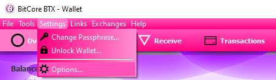
  
    Set "Show Masternodes Tab"
    
    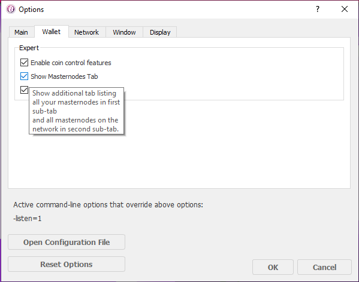

    Restart your Wallet, then you should see the "Masternodes" Tab in your Wallet.

5. Create a new Wallet address for your masternode collateral.

    Choose a masternode alias (e.g. mn01) and save it in a text file, you need it for the masternode.conf and for easyMN.services.

    Open the Console...
    
    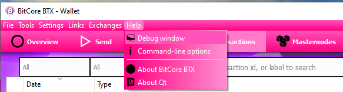

    ... and type in the following command ``getnewaddress "mn01" "legacy"``
    
    

    Save this collateral address in a text file, you need this for easyMN.services.

6. Send 2,100 BTX coins to your new generated wallet address and wait for 15 confirmations

    

7. Generate a private key for your masternode

    Open the Console...
    
    

    ... and type in the following command ``masternode genkey``

   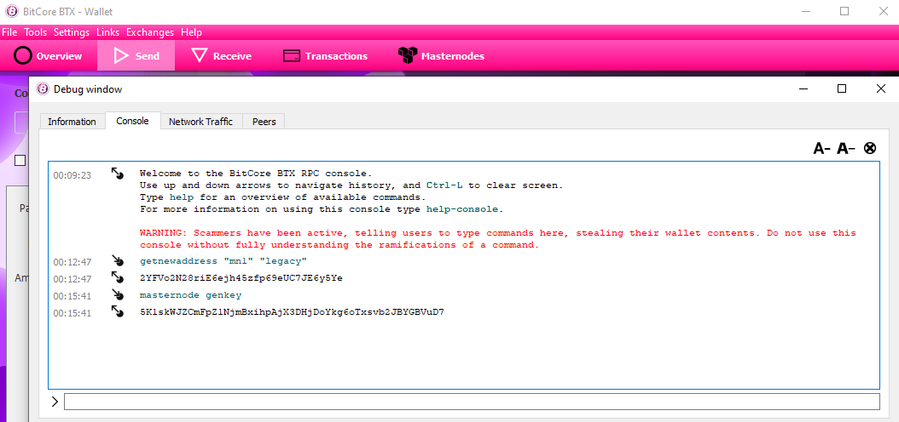

    Save this MASTERNODE_KEY in a text file, you need it for the masternode.conf and for easyMN.services.

8. Get your masternode collateral output

    Open the Console...
    
    

    ... and type in the following command ``masternode outputs``
    
    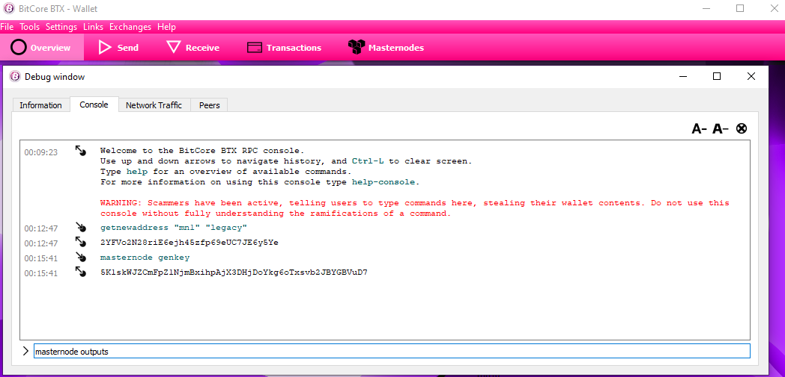

    The first value is the transaction ID (TX_ID). Save it in a text file, you need it for the masternode.conf and for easyMN.services.
    
    The second value is the transaction Index (TX_INDEX). Save it in a text file, you need it for the masternode.conf.
   
</details>
<details>
<summary>
<b>Booking the Masternode-Server-Hosting</b>
</summary>

9. Make all information available to easyMN.service for setting up the server by filling out the website form on easymn.services and selecting the desired desired service package.

    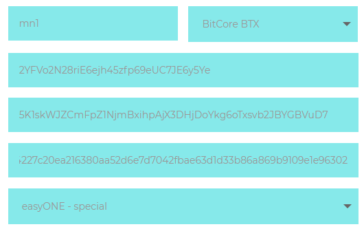
    
    * The Masternode alias name
      * e.g. mn1, is used in the email notification
    * The Collateral Wallet Address
      * Your address where you have sent your coins for the MN
    * TransactionID (txid) 
      * In which you can see at which address the Masternode Collaterals
    * The masternode key
      * Needed for the communication between your wallet and the masternode server hosting of easyMN.services.

</details>
<details>
<summary>
<b>Activate your Masternode</b>
</summary>

10. After the masternode server hosting has been set up by easyMN.services for your masternode, you will receive an email from easyMN.services telling you which IP address to enter in your masternode.conf.

11. Open the masternode.conf file and enter all needed information, e.g.

    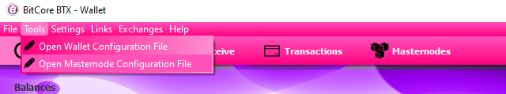

    ```sh
    #MN_ALIAS IP_ADDRESS:8329 MASTERNODE_KEY TX_ID TX_INDEX
    mn1 IP_FORM_EASYMN:8329 5K1skWJZCmFpZ1NjmBxihpAjX3DHjDoYkg6oTxsvb2JBYGBVuD7 bbb994227c20ea216380aa52d6e7d7042fbae63d1d33b86a869b9109e1e96302 0
     ```
     
12. Activate your Masternode via your BitCore BTX QT Wallet

    Open the Console...
    
    

    ... and type in the following command ``masternode start-alias mn1``
     
    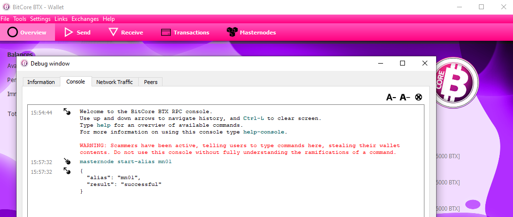

NOTICE: If your wallet is encrypted, you have to enter your password.

Now your Masternode Status will be PRE_ENABLED. It normally takes about 20 minutes until the masternode is set to ENABLED, but it can also take longer. 
</details>

## BitCloud Masternode
<details>
<summary>
<b>Wallet Setup</b>
</summary>

1. Download latest Bitcloud BTDX QT Wallet from our GitHub: https://github.com/LIMXTEC/Bitcloud/releases
  
2. Start your Bitcloud BTDX QT QT Wallet and wait until it's fully synchronized.

3. OPTIONAL: Encrypt your wallet (best with a strong password)

4. Activate "Masternodes" Tab

    Goto "Settings" and open "Options..."
    
    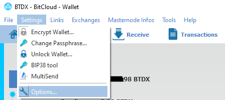
  
    Set "Show Masternodes Tab"
    
    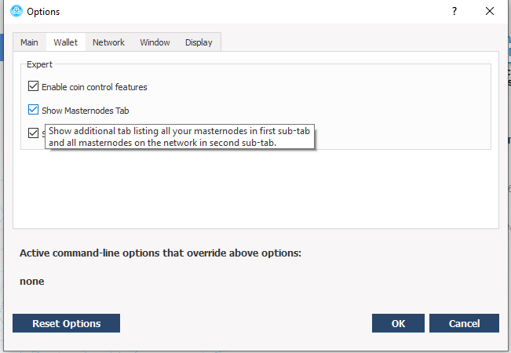

    Restart your Wallet, then you should see the "Masternodes" Tab in your Wallet.

5. Create a new Wallet address for your masternode collateral.

    Choose a masternode alias (e.g. mn01) and save it in a text file, you need it for the masternode.conf and for easyMN.services.

    Open the Console...
    
    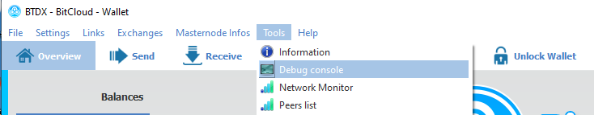

    ... and type in the following command ``getnewaddress "mn01"``
    
    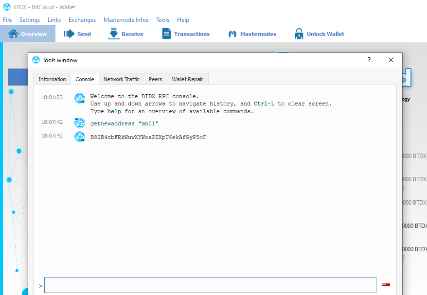

    Save this collateral address in a text file, you need this for easyMN.services.

6. Send 10,000 BTDX coins to your new generated wallet address and wait for 15 confirmations

    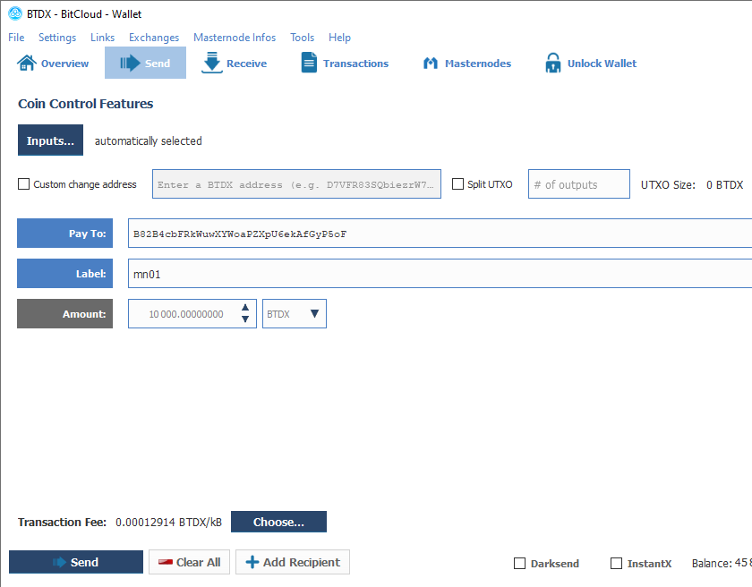

7. Generate a private key for your masternode

    Open the Console...
    
    

    ... and type in the following command ``masternode genkey``

   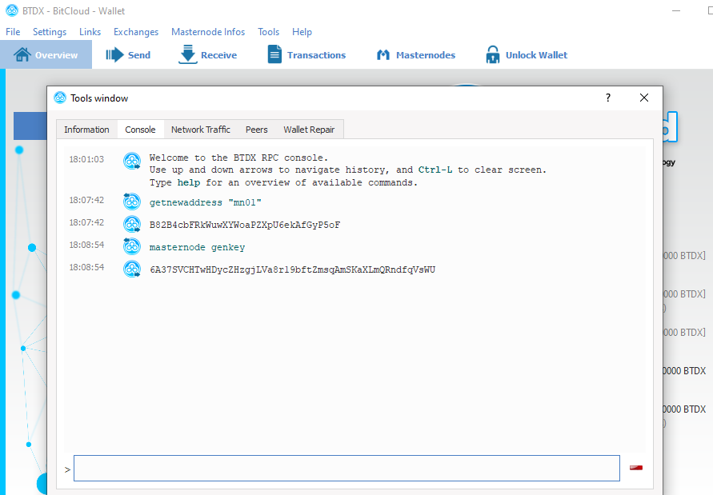

    Save this MASTERNODE_KEY in a text file, you need it for the masternode.conf and for easyMN.services.

8. Get your masternode collateral output

    Open the Console...
    
    

    ... and type in the following command ``masternode outputs``
    
    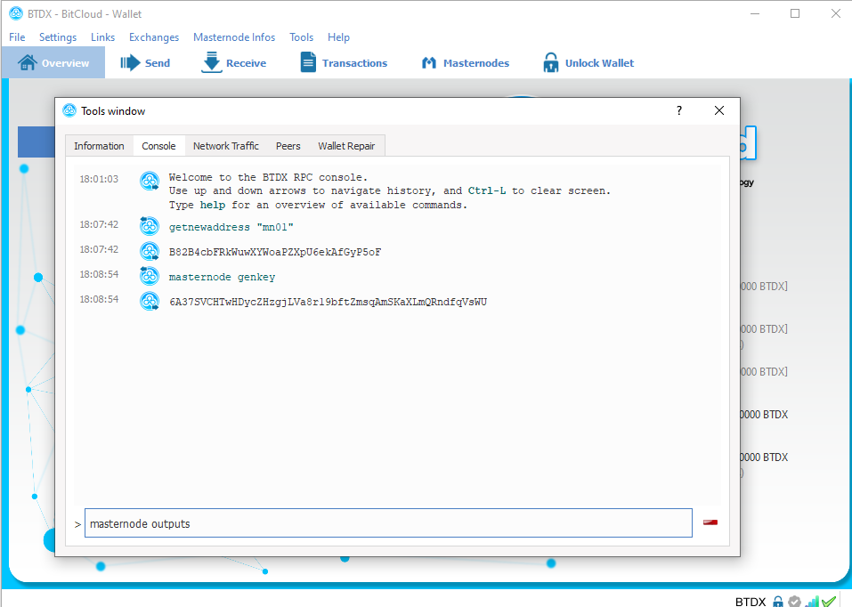

    The first value is the transaction ID (TX_ID). Save it in a text file, you need it for the masternode.conf and for easyMN.services.
    
    The second value is the transaction Index (TX_INDEX). Save it in a text file, you need it for the masternode.conf.
    
</details>
<details>
<summary>
<b>Booking the Masternode-Server-Hosting</b>
</summary>

9. Make all information available to easyMN.service for setting up the server by filling out the website form on easymn.services and selecting the desired desired service package.

    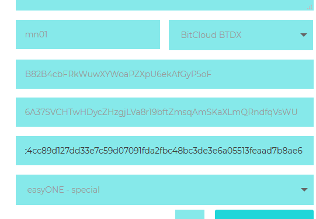
    
    * The Masternode alias name
      * e.g. mn01, is used in the email notification
    * The Collateral Wallet Address
      * Your address where you have sent your coins for the MN
    * TransactionID (txid) 
      * In which you can see at which address the Masternode Collaterals
    * The masternode key
      * Needed for the communication between your wallet and the masternode server hosting of easyMN.services.

</details>
<details>
<summary>
<b>Activate your Masternode</b>
</summary>

10. After the masternode server hosting has been set up by easyMN.services for your masternode, you will receive an email from easyMN.services telling you which IP address to enter in your masternode.conf.

11. Open the masternode.conf file and enter all needed information, e.g.

    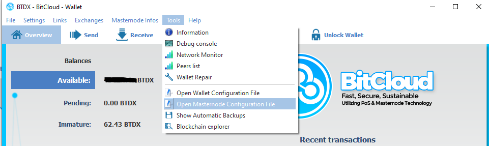

    ```sh
    #MN_ALIAS IP_ADDRESS:8555 MASTERNODE_KEY TX_ID TX_INDEX
    mn01 IP_FORM_EASYMN:8555 6A37SVCHTwHDycZHzgjLVa8r19bftZmsqAmSKaXLmQRndfqVsWU bbb994227c20ea216380aa52d6e7d7042fbae63d1d33b86a869b9109e1e96302 0
     ```
12. Activate your Masternode via your BitCLoud BTDX QT Wallet

    Open the Console...
    
    

    ... and type in the following command ``masternode start-alias mn01``
     
    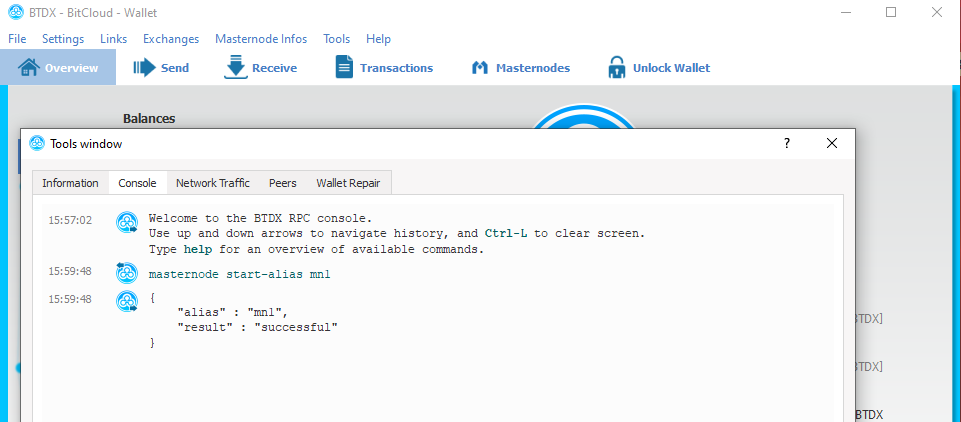

NOTICE: If your wallet is encrypted, you have to enter your password.

Now your Masternode Status will be PRE_ENABLED. It normally takes about 20 minutes until the masternode is set to ENABLED, but it can also take longer. 
</details>


## BitSend Masternode
<details>
<summary>
<b>Wallet Setup</b>
</summary>

1. Download lastest BitSend BSD QT Wallet from our GitHub: https://github.com/LIMXTEC/BitSend/releases

2. Start your BitSend BSD QT Wallet and wait until it's fully synchronized.

3. OPTIONAL: Encrypt your wallet (best with a strong password)

4. Open the bitsend.conf file and add option ``promode=1``

    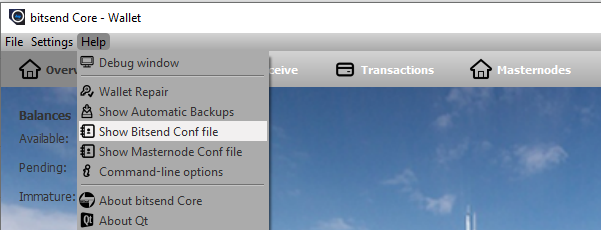

5. Activate "Coin control features"

    Goto "Settings" and open "Options..."
    
    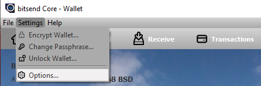
  
    Set "Enable coin control features"
    
    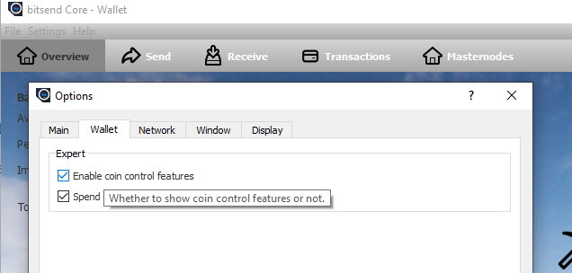

    Restart your Wallet, then you should see the "Masternodes" Tab in your Wallet.

6. Create a new Wallet address for your masternode collateral.

    Choose a masternode alias (e.g. mn01) and save it in a text file, you need it for the masternode.conf and for easyMN.services.

    Open the Console...
    
    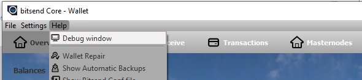

    ... and type in the following command ``getnewaddress "mn1"``
    
    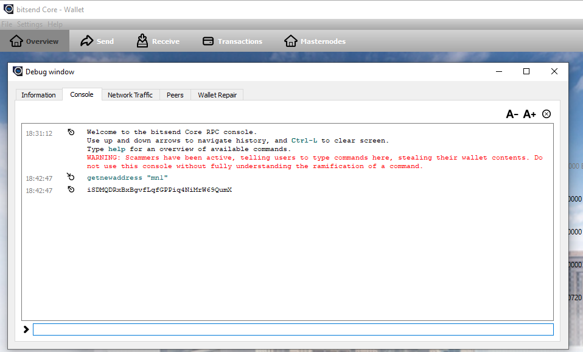

    Save this collateral address in a text file, you need this for easyMN.services.

7. Send 25,000 BTDX coins to your new generated wallet address and wait for 15 confirmations

    

8. Generate a private key for your masternode

    Open the Console...
    
    

    ... and type in the following command ``masternode genkey``

   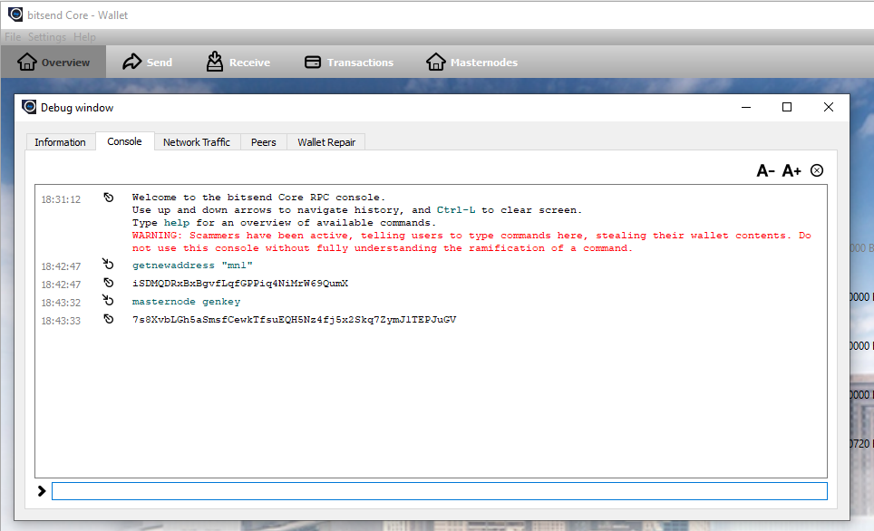

    Save this MASTERNODE_KEY in a text file, you need it for the masternode.conf and for easyMN.services.

9. Get your masternode collateral output

    Open the Console...
    
    

    ... and type in the following command ``masternode outputs``
    
    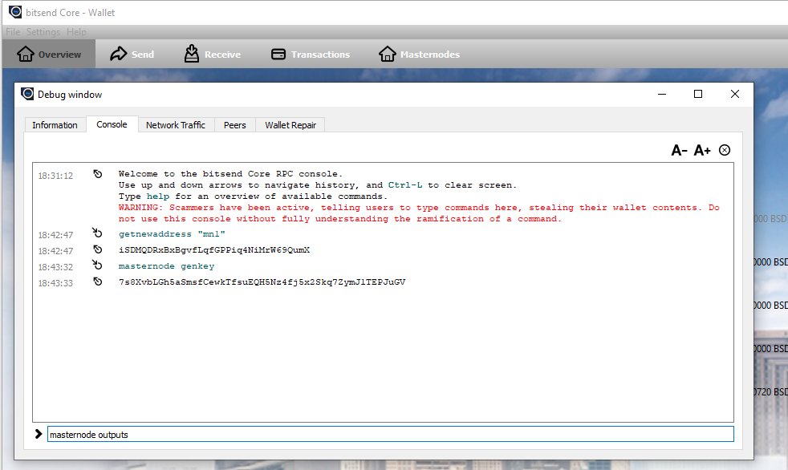

    The first value is the transaction ID (TX_ID). Save it in a text file, you need it for the masternode.conf and for easyMN.services.
    
    The second value is the transaction Index (TX_INDEX). Save it in a text file, you need it for the masternode.conf.

</details>
<details>
<summary>
<b>Booking the Masternode-Server-Hosting</b>
</summary>

10. Make all information available to easyMN.service for setting up the server by filling out the website form on easymn.services and selecting the desired desired service package.

    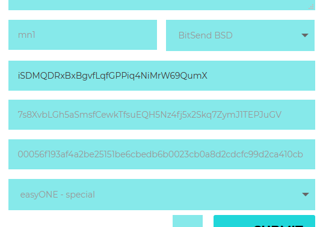
    
    * The Masternode alias name
      * e.g. mn1, is used in the email notification
    * The Collateral Wallet Address
      * Your address where you have sent your coins for the MN
    * TransactionID (txid) 
      * In which you can see at which address the Masternode Collaterals
    * The masternode key
      * Needed for the communication between your wallet and the masternode server hosting of easyMN.services.

</details>
<details>
<summary>
<b>Activate your Masternode</b>
</summary>

11. After the masternode server hosting has been set up by easyMN.services for your masternode, you will receive an email from easyMN.services telling you which IP address to enter in your masternode.conf.

12. Open the masternode.conf file and enter all needed information, e.g.

    

    ```sh
    #MN_ALIAS IP_ADDRESS:8886 MASTERNODE_KEY TX_ID TX_INDEX
    mn1 IP_FORM_EASYMN:8886 7s8XvbLGh5aSmsfCewkTfsuEQH5Nz4fj5x2Skq7ZymJ1TEPJuGV 00000000056f193af4a2be25151be6cbedb6b0023cb0a8d2cdcfc99d2ca410cb  0
     ```

13. Activate your Masternode via your BitSend BSD QT Wallet

    Select on "Send" Tab the button "Inputs..." to open the "Coin Selection" dialog. Unlock your masternode collateral of 25,000 BSD to allow the masternode to be started.

    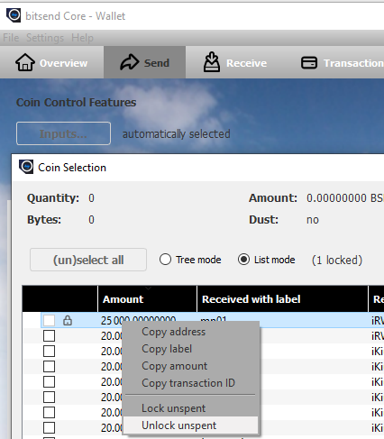

    Open the Console...
    
    

    ... and type in the following command ``masternode start-alias mn1``
     
    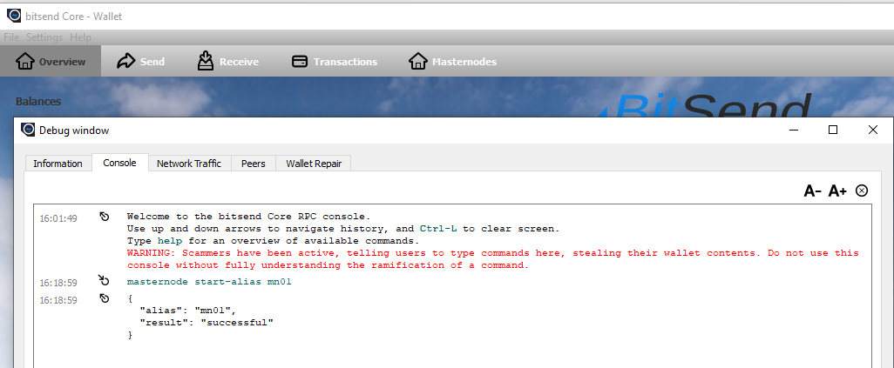

NOTICE: If your wallet is encrypted, you have to enter your password.

Now your Masternode Status will be PRE_ENABLED. It normally takes about 20 minutes until the masternode is set to ENABLED, but it can also take longer. 
</details>


## Megacoin Masternode
<details>
<summary>
<b>Wallet Setup</b>
</summary>

1. Download the latest Megacoin MΣC QT Wallet from LIMXTEC GitHub: https://github.com/LIMXTEC/Megacoin/releases
  
2. Start your Megacoin MΣC QT Wallet and wait until it's fully synchronized.

3. OPTIONAL: Encrypt your wallet (best with a strong password)

4. Activate "Masternodes" Tab

    Goto "Settings" and open "Options..."
    
    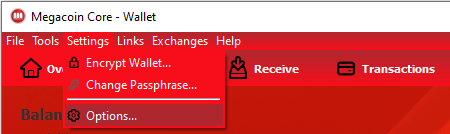
  
    Set "Show Masternodes Tab"
    
    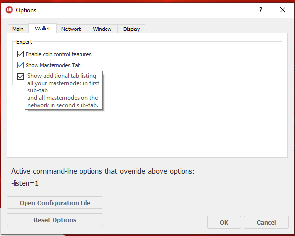

    Restart your Wallet, then you should see the "Masternodes" Tab in your Wallet.

5. Create a new Wallet address for your masternode collateral.

    Choose a masternode alias (e.g. mn1) and save it in a text file, you need it for the masternode.conf and for easyMN.services.

    Open the Console...
    
    

    ... and type in the following command ``getnewaddress "mn1" "legacy"``
    
    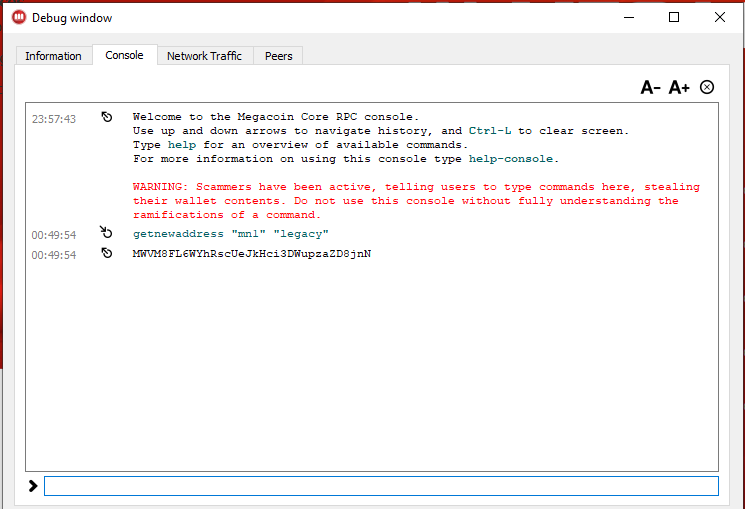

    Save this collateral address in a text file, you need this for easyMN.services.

6. Send 4,200 MΣC coins to your new generated wallet address and wait for 15 confirmations

    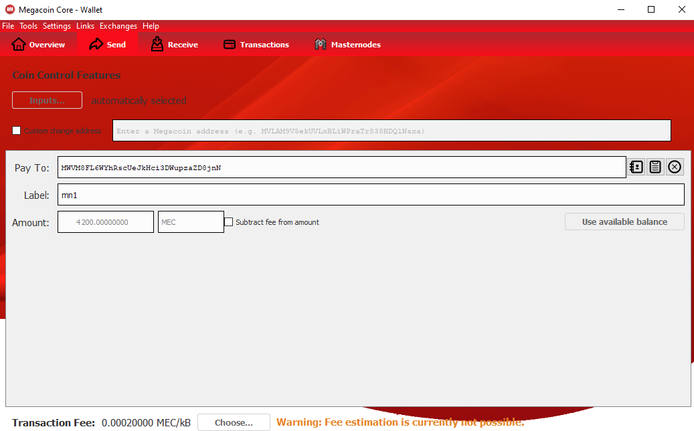

7. Generate a private key for your masternode

    Open the Console...
    
    

    ... and type in the following command ``masternode genkey``

   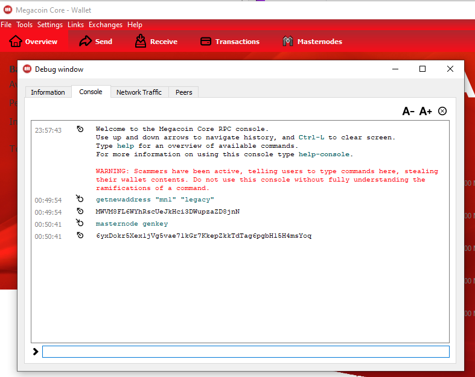

    Save this MASTERNODE_KEY in a text file, you need it for the masternode.conf and for easyMN.services.

8. Get your masternode collateral output

    Open the Console...
    
    

    ... and type in the following command ``masternode outputs``
    
    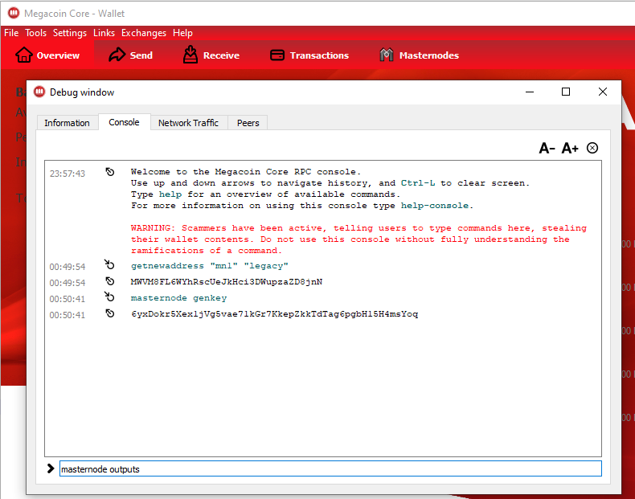

    The first value is the transaction ID (TX_ID). Save it in a text file, you need it for the masternode.conf and for easyMN.services.
    
    The second value is the transaction Index (TX_INDEX). Save it in a text file, you need it for the masternode.conf.

</details>
<details>
<summary>
<b>Booking the Masternode-Server-Hosting</b>
</summary>

9. Make all information available to easyMN.service for setting up the server by filling out the website form on easymn.services and selecting the desired desired service package.

    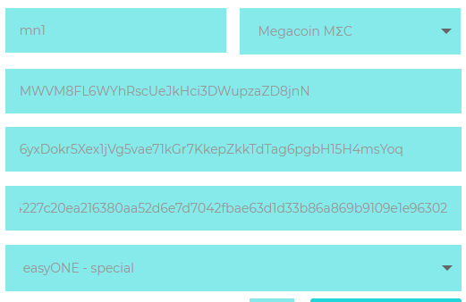
    
    * The Masternode alias name
      * e.g. mn1, is used in the email notification
    * The Collateral Wallet Address
      * Your address where you have sent your coins for the MN
    * TransactionID (txid) 
      * In which you can see at which address the Masternode Collaterals
    * The masternode key
      * Needed for the communication between your wallet and the masternode server hosting of easyMN.services.

</details>
<details>
<summary>
<b>Activate your Masternode</b>
</summary>

10. After the masternode server hosting has been set up by easyMN.services for your masternode, you will receive an email from easyMN.services telling you which IP address to enter in your masternode.conf.

11. Open the masternode.conf file and enter all needed information, e.g.

    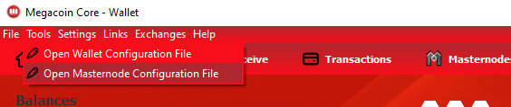

    ```sh
    #MN_ALIAS IP_ADDRESS:7951 MASTERNODE_KEY TX_ID TX_INDEX
    mn1 IP_FORM_EASYMN:7951 6yxDokr5Xex1jVg5vae71kGr7KkepZkkTdTag6pgbH15H4msYoq 7e60b6266962f59d2775b592b59debe70d41b7a8a69134d80035429e8e0b24fa 0
     ```

12. Activate your Masternode via your Megacoin MΣC QT Wallet

    Open the Console...
    
    

    ... and type in the following command ``masternode start-alias mn1``
     
    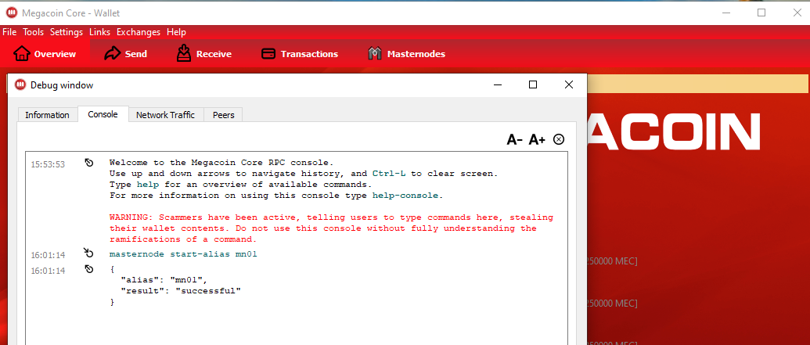

NOTICE: If your wallet is encrypted, you have to enter your password.

Now your Masternode Status will be PRE_ENABLED. It normally takes about 20 minutes until the masternode is set to ENABLED, but it can also take longer. 
</details>
