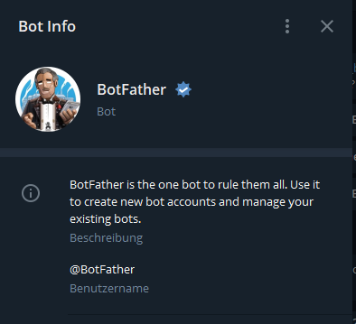
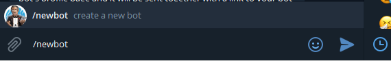
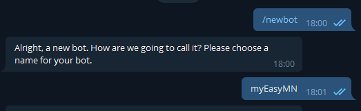
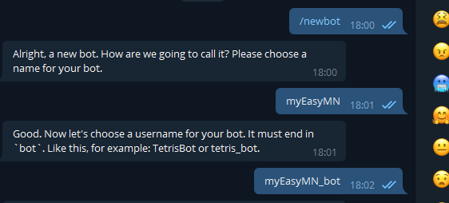
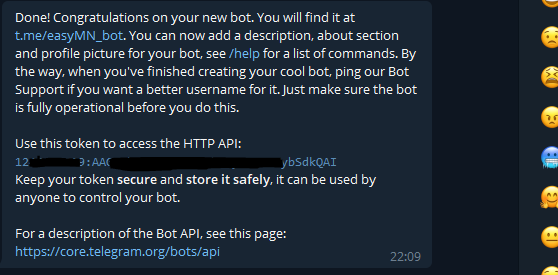
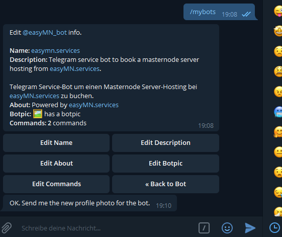
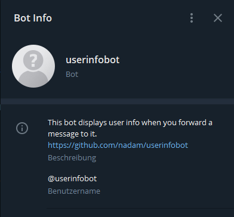
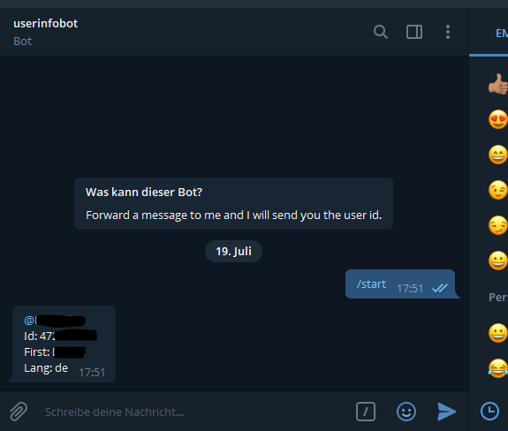

# easyBot

**Create your own telegram bot to receive easymn.services notifications for your MNs**

<b>Create a Telegram Bot</b>

In order to create a Telegram Bot, you will need to contact @BotFather.

**Steps are:**

1. Send /newbot in @BotFather chat

2. Give a human-readable name for the bot, e.g. myEasyMN

3. Give a computer-readable username for your bot, e.g. myEasyMN_bot

4. Then @BotFather will provide you a token for HTTP API. Provide this HTTP API token to easyMN.services.

5. Now, search your bot with the username you've just set and send the bot an initial message (important!) to activate the bot.

6. OPTIONAL: Change the bot picture

- Send /mybots in @BotFather chat
- Choose your bot from the list
- Select "Edit bot"
- Select "Edit botpic"

- Send BotFather your desired picture - you could use the following easyMN.services logo: https://github.com/dalijolijo/easyMN.services/blob/master/bot_logo.jpg

<b>Get your Telegram User ID</b>

In order to get your Telegram User ID, you will need to contact @userinfobot. 

**Steps are:**

1. Send /start in @userinfobot chat and you get your Telegram User ID

<b>Provide the information to easyMN.services</b>

Send an email to support@easymn.services with the following information:

1) Your contract number (find it on your invoice)
2) The Telegram token for HTTP API
3) Your Telegram User ID

